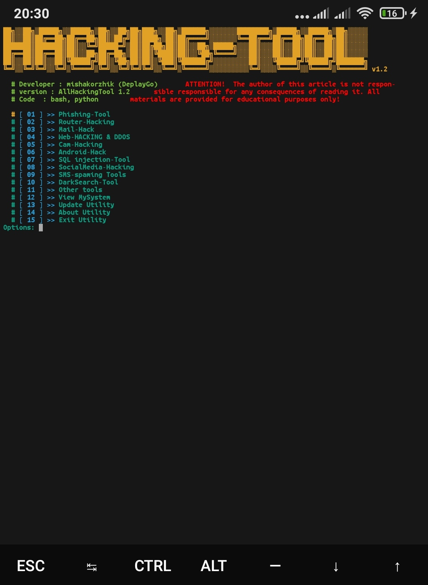

# AllHackingTools

####  Hi, if you want to set up a termux quickly, here you are!
####  More Hacking tools with one tool!

---

## Installing for termux.

* `pkg install git`
* `git clone https://github.com/mishakorzik/AllHackingTools`
* `cd AllHackingTools`
* `bash Install.sh`

---

## Installing for linux.

* `pkg install git`
* `git clone https://github.com/mishakorzik/AllHackingTools`
* `cd AllHackingTools`
* `bash Files/Modules.sh`

#### Everything is ready!  Now we are waiting for everything to download!

* `Succes!`
----
## Dependencies
#### If all this is then you can download!

* `Ram  : 2GB`
* `Root : NO ROOT`

#### Okay let's go installing!
#### if it shows Are you rooted? Then ignore it!
---------
## What does it download?
* `git` `python` 
* `wget` `curl`
* `openssh` `php`
* `toilet` `colorama`
* `jq` `apache2`
* `ruby` `ssl`
* `w3m` `figlet`
* `zip` `lolcat`
* `pv` `neofetch`
* `zsh` 

#### And More packages!

------
## Screanshot
#### view a screanshot for allHackingTool
 

 

-----
## Download more utility for hacking!

#### uninstall AllHackingTools

* `bash Uninstall/Uninstall.sh`
#### succesfull!
------
## Start utility for hacking!
#### cd && cd AllHackingTools && bash AllHackingTool.sh 

#### It downloads packages and utilities and configures the utilities.

###### Trank for downloading.
###### By MishaKorzhik
  

